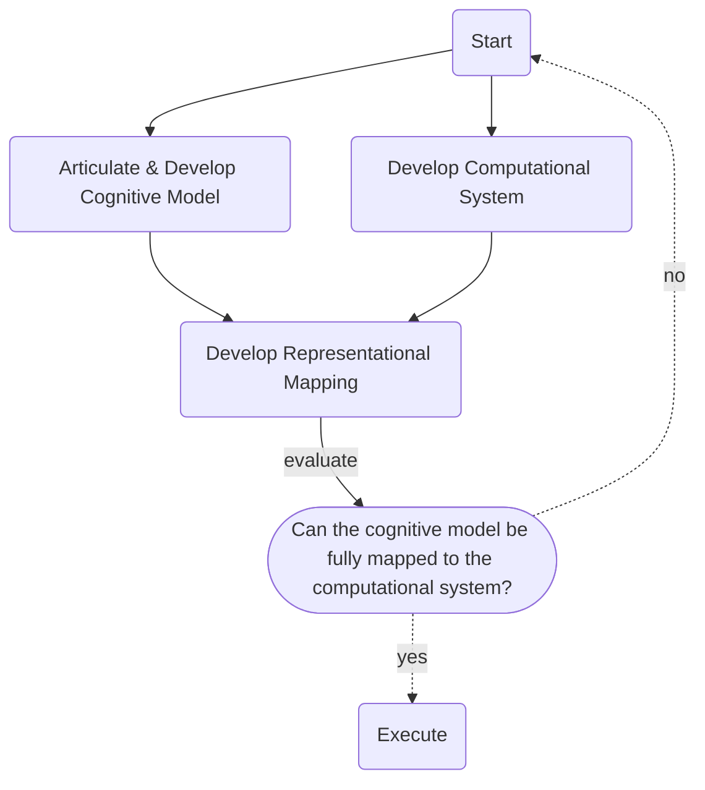

# Designing Computational Systems of Cognitive Models

In this document, I aim to articulate how we can design computational systems that implement our cognitive models.

[TOC]

## Systems & Models

A System is an object or process that functions as a composite of discrete parts, principles or procedures cooperatively operating together. For our context, it is imperative that when work is applied to a system by an external entity, the system's internal state changes; the system may consequently produce some side-effect to it's environment (conceptualized as the system doing work).

A Model is a cognitive representation of a system, implemented as another system. It aims to reproduce or emulate the behavior, partially or in full, of the system being modeled.

A Cognitive Model is a cooperative collection of conceptual ideas & principles that serve as a vessel by which intelligent entities articulate and comprehend a system.

A Computational System is a collection of computer hardware executing software which produce a side effect or otherwise calculate information for further use.

As such, an intelligent entity can use computational systems to implement, evaluate & enact their cognitive models.

## Design Framework

Software development is the loose design framework that encompasses:

- Articulating a conceptual model of a system.
- Instructing a computer how to operate in order to achieve a side-effect or produced information.

Generally this entails using a programming language to both articulate a conceptualization & implement computational instructions. Programming paradigms such as imperative, declarative, functional & object oriented, are all specialized applications of this framework. I propose another specialized application of the software development framework.

My framework focuses on delineation of the software development process into constituent procedures that isolate the cognitive representation of the various systems. It also provides principles to guide consistent outcomes.

First, the major constituent procedures are:

- Develop the cognitive model; articulate the system you are modeling & the desired side-effects of the model when work is applied.
- Concurrently develop the computational system.
- Develop a computational representation of the cognitive model by mapping the cognitive model onto the computational system.
  - If the cognitive model cannot be mapped then iterate the framework.
  - Otherwise the cognitive model can be executed.

The general flow of these procedures follows:

Next, let's discuss the principles that should guide designs & developments to achieve consistent & effective results. Not all principles need be applied every time, but collectively they should ensure success.

### The First Principle

The first principle describes ways to articulate & develop a cognitive model of a system using `types` & `protocols`.

Plainly:

- Use `types` to describe the data or information that can have work applied on them or by them. Such work applied on or by types should induce or contribute in part or in full to a state change or a side-effect of the system.
- Use `protocols` to define similar functionality & context within a system that allows interchanging `types` to better model cognitive ideas; functionality relates to actionability while context relates to state.

More formally:

- A `type` is an implementation of semantics & capabilities applied to data.

- A `protocol` declares a set of semantics & capabilities such that any `type` having these semantics & capabilities, irrespective of implementation, can be classified as enacting the `protocol`.
- Semantics deal with the meaning of data & how this meaning is contextualized within an intelligent entity's understanding of a system. Semantics include implied knowledge, logical rules & descriptive boundaries.
- Capabilities deal with the actions & abilities that can be performed on, by or with the data contextualized to its semantics within the system.

### The Second Principle

> TODO: Need to think through & expand on this more

The second principle describes a common approach to articulating a cognitive model using a Domain Specific Language (DSL) based on Natural Language (NL) Paradigms.

Plainly:

- Using a DSL-NL simplifies the process of articulating the Cognitive Model & ensures a common vernacular.

  - Natural language (NL) is a capability intelligent entities use to externalize knowledge; the process of articulating comprehension & implicit knowledge is already captured in the prose of natural language. However, in its native forms (such as English), it is generalized which gives rise to ambiguity & design complexity.

  - Crafting a DSL based on NL simplifies articulating cognitive models with precision & accuracy. Likewise, development of the language itself serves as a process to refine understanding, narrow scope & materialize implicit knowledge.

- The DSL-NL should be fully deterministic to allow repeatable parsing while ensuring ambiguity is minimized (ideally eliminated). Ambiguity is a strong indicator that a cognitive model is incomplete. If a concept cannot be plainly articulated then it is likely that a concept is not mappable to the computational system.
- The granularity & verbosity of as DSL-NL is a tradeoff between time & effort. The depth, precision & accuracy of the DSL-NL should minimally meet the requirements necessary for actionability. These requirements are relative & subjective to the intelligent entities reading & writing the DSL-NL & mapping it to the computational system.
- Immediate or excessive generalization is an indicator that a cognitive model is incomplete. Likewise attempting to structure concepts into a hierarchy can indicate a gap in implied knowledge. Usage & application of generalization techniques is neither encouraged or discouraged but it's use should be heavily scrutinized for applicability.

### The Third Principle

> TODO: Need to think through & expand on this more

The third layer details the scopes & strengths of the three layers.

Plainly:

- The Cognitive Model Layer captures the "what" , "why" & "how" of cognitive systems qualifying the semantics & capabilities.
  - What constitutes the cognitive system & why?
  - How do the constituents interact with one another?
- The Computational Model Layer captures the "what" , "why" & "how" of computational systems: various paradigms & frameworks for efficiently instructing a computer.
  - What computational capabilities does a computer have? How are they applied?
  - How do we represent mathematical data structures (like a graph) into a computational framework? Why?
- The Representational Mapping Layer captures the "how" of computing a cognitive model. While no new types or protocols are introduced in this layer, imperative work is introduced to coerce cognitive  ideas into a composite of literal computational processes.
  - A Basic example could be pattern extraction. A Cognitive Model would imply; `match the pattern foo in the file` (or even declaring how to search for the pattern) while a computational model would deal with the iteration & indexing of the pattern `foo`, the loading & management of the file's content into a memory buffer, etc...
  - Changes in the evolution of computational capabilities & cognitive systems reflect in the differential between commits of the RML. This allows for traceability in changing paradigms, implicit knowledge & growing capabilities.
  - An inability or high difficulty in specifying the imperative work to map between system spaces quickly makes it apparent that either or both system models are lacking & need to be iterated.
  - Optimization of implementation is isolated from the cognitive models; by optimizing the computational layer any project sharing this layer can directly benefit after minimal rework. When the computational systems are tightly integrated w/ the cognitive models (such as in traditional high level programming models), then major refactoring is required to leverage optimizations.
